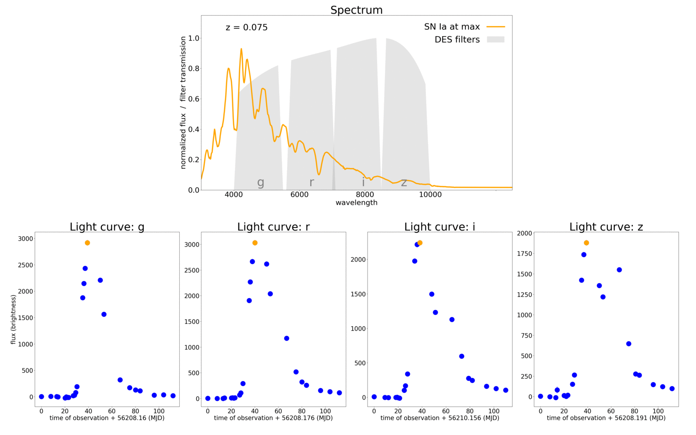

# PLAsTiCC RAMP starting kit

Classification of transients using light curves data.

Authors: Alexandre Boucaud & Emille Ishida

[](https://travis-ci.org/ramp-kits/supernovae)



### Getting started

1. Install [`ramp-worflow`](https://github.com/paris-saclay-cds/ramp-workflow) (a.k.a. `rampwf`)
    ```
    pip install git+https://github.com/paris-saclay-cds/ramp-workflow.git
    ```
2. Clone this repo, download the data and install dependencies
    ```
    git clone https://github.com/ramp-kits/supernovae.git
    cd supernovae
    python download_data.py
    pip install -r requirements.txt
    ```
3. Test the default submission
    ```
    ramp_test_submission --quick-test
    ```

Visit the [`ramp-worflow` wiki](https://github.com/paris-saclay-cds/ramp-workflow/wiki) for more help on the [RAMP](http://ramp.studio) ecosystem.

### Notebook

Get started on this RAMP with the [dedicated notebook](PLAsTiCC_starting_kit.ipynb).
